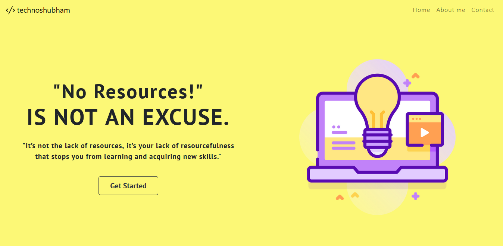
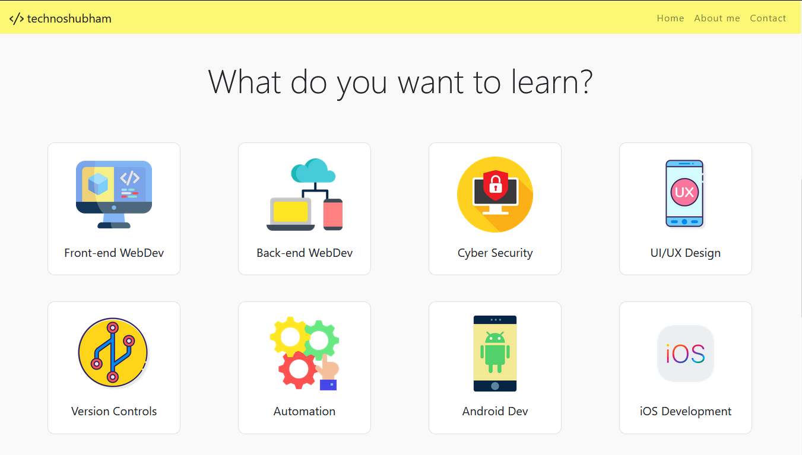

 

 
<h1>RESOURCES</h1>

   
  
 
<h3>A one-stop forum for resources related to Web development(frontend+backend), App Development, Information Security, UI/UX Design, Automation etc.
</h3>

 

   
  <h3>Streams<h3>
   
 

  
 
    
 
 
A Shubham Dangi Production.

    
inspired by the 'awesome *' github community 

    
&#10084;&#65039;
